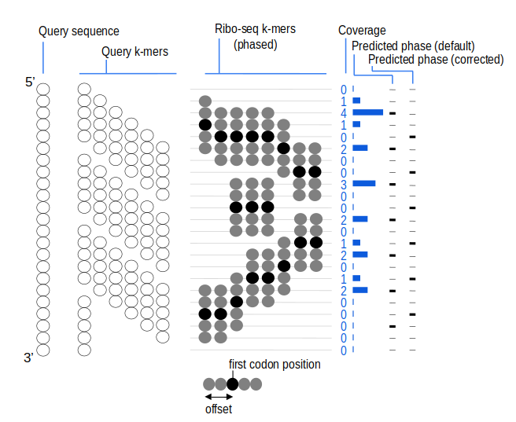
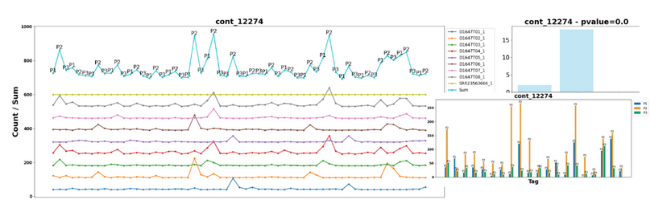

# RiboKast: Reference-Free Translation Prediction from Ribo-Seq Data Using K-mers

## 🧬 Overview

**RiboKast** is a reference-free computational pipeline for identifying translated ORFs from RNA sequences using ribosome profiling (ribo-seq) data. It queries k-mers from input RNA sequences against a ribo-seq k-mer index and analyzes frame-specific coverage to determine translation activity. It is especially useful for novel transcript discovery and non-model organisms, requiring no reference genome or annotation.
To build the Ribo-seq k-mer index required by RiboKast, you can use [RiboKastIndex](https://github.com/Transipedia/RiboKastIndex). This companion tool lets you construct a custom KaMRaT-compatible index from the Ribo-seq datasets of your choice (e.g., specific tissues, conditions, or organisms). Once the index is generated, you can provide its path to RiboKast to query your input sequences and perform frame-aware translation prediction.

---

## ⚙️ Prerequisites

### 1. Set Up and Activate Conda Environment

The pipeline relies on a Conda environment defined in the `RiboKastIndex.yaml` file. Follow the steps below to set up and activate the environment.

#### Step 1: Create the Conda Environment

If the environment is not already created, follow these steps to create it:

1. **Install Miniconda or Conda** if it's not already installed:
   - [Miniconda Installation Guide](https://docs.conda.io/en/latest/miniconda.html)

2. **Create the environment** 
RiboKast is shipped with a ready-to-use Conda environment file:

- `envs/ribokast.yaml`

Create and activate the environment:

```bash
# 1) create the environment
conda env create -f envs/ribokast.yaml

# 2) activate it
conda activate ribokast
```
### 2. Install and Configure KaMRaT

The pipeline uses **KaMRaT** for k-mer analysis. Follow these steps to download and configure the **KaMRaT** Singularity image:

1. **Download the KaMRaT Singularity image (.sif)** from the official GitHub repository:
   - [KaMRaT GitHub](https://github.com/Transipedia/KaMRaT)

2. Use the following command to download the image:
   ```bash
   singularity pull KaMRaT.sif docker://transipedia/kamrat:latest
   ```

3. **Configure the path** to the downloaded image in the `config.sh` file under the `kamratImg` key:
   ```yaml
   kamratImg: "/path/to/KaMRaT.sif"
   ```

   Replace `/path/to/KaMRaT.sif` with the actual path where the Singularity image is located.


## 🧪 Protocol Workflow

### A. Contig-Level Analysis

1. **K-mer Generation**: Input RNA sequences are split into overlapping k-mers.
2. **K-mer Querying**: Each k-mer is queried against a ribo-seq index using KaMRaT.
3. **Coverage Summing**: Ribo-seq signal is summed per reading frame (P1, P2, P3).
4. **Frame Prediction**: The frame with the highest signal is considered dominant.
5. **Statistical Validation**: A binomial test is performed (p < 0.05).
6. **Contig Classification**:
   - **RS+P+**: Signal present, dominant frame validated.
   - **RS+P-**: Signal present, but frame not validated.
   - **RS-**: No ribo-seq signal detected.



**Figure – RiboKast strategy.** The central part (Ribo-seq k-mers) represents an index of k-mers extracted from multiple ribo-seq experiments. In this index, all k-mers have the same size and codon position. K-mers from the query sequence are queried against the index to produce a coverage vector. The major phase (predicted phase) is inferred from the coverage vector. A binomial test evaluates the significance of the major phase compared to alternative phases. Optionally, the reading phase can be corrected (adding +1 or +2) based on the offset of codons in ribo-seq k-mers.


### 1) RiboKast contig-level query
RiboKast queries k-mers from the input contig sequences against the Ribo-seq k-mer index and assigns each contig to one of the following classes:
- **RS+P+**: Ribo-seq signal detected and a dominant frame is statistically validated
- **RS+P-**: Ribo-seq signal detected but the dominant frame is not statistically validated
- **RS-**: no Ribo-seq signal detected

### 2) ORF prediction and translation
ORF prediction is performed on contigs classified as **RS+P+**, **RS+P-**, and **RS-**.

**Translation strategy**
- **RS+P+ contigs:** translate only in the **predicted frame**.
- **RS+P- and RS- contigs:** translate in the **three frames**.

> Assumption: contigs are already strand-specific.  
> If your assembly is unstranded, both orientations (forward and reverse-complement) should be present in the input FASTA (e.g., `*_unsSeq` and `*_unsRev`).

**Peptide selection rules**
- Keep the peptide sequence **before the first stop codon**.
- After the first stop codon, also keep peptides that:
  - **start with `M`**, and
  - extend **until the next stop codon**.
This step produces a set of candidate peptide ORFs (and their corresponding nucleotide regions).

### 3) Re-assign RS state at the ORF level

Each predicted ORF is mapped back to its parent contig to identify the nucleotide region corresponding to the ORF.  
That nucleotide region is then queried again against the Ribo-seq index to assign an **ORF-level RS state** (RS+P+, RS+P-, or RS-), since a single contig can contain multiple ORFs with different local Ribo-seq support.

## 📁 Input Format

### 🧬 Example Input FASTA

```fasta
>cont_7
AAAAAAAAAAAAAAAAAAAAAGCAGCAGCACCTCATCCATTCAAGTTTGATCACGAGATTGAAGCAATTCAGTGACATCTTTAGGCTACACTTCTAAATCTAGCTCTCTTGCTATTTTCACCACATCTATAGTTGCTTCCTCCACTGAAGTCTCAAACCCCTCAAAGATTCATGAGGGCTGGAATCAGGTTTTTCCAAAATAC
>cont_40
AAAAAAAAAAAAAAAACCATGCATTGCTGCTTTTCCTACCACTTCCAGTAAGAAAATGGG
```

Each sequence in the FASTA file represents a contig with a unique identifier (`>cont_X`). These RNA sequences serve as the input for k-mer generation and ribo-seq signal querying throughout the pipeline.

---

### 📝 Optional: Annotation File

Predicted peptides can optionally be merged with external annotations to enrich biological interpretation. This is done by providing an **annotation file** (TSV format), typically generated using the [Annotate-contigs](https://github.com/Transipedia/Annotate-contigs) tool.
> If provided, the annotation file is automatically integrated during the final merge step, linking peptide-level predictions with known biological features.


## 📤 Output

- **RS+P+**: High ribo-seq signal and validated dominant frame.
- **RS+P-**: Signal present, frame not statistically validated.
- **RS-**: No ribo-seq signal.

## 📤 Output Example

The RiboKast pipeline produces results at both the **contig level** and the **ORF (peptide) level**.

---

### 🧬 Contig-Level Output

**File:** `KmersFromContigsQuerySumPhaseSeqTranslatedPvalueRSState`  
This file summarizes k-mer coverage and translation frame predictions for each contig.

**Columns:**
- `contig`: Nucleotide sequence of the contig
- `ID_contig`: Contig identifier
- `P1`, `P2`, `P3`: Read counts per frame
- `Dominant_Phase`: Most expressed reading frame (p1/p2/p3)
- `Functional_dominant_phase`: Frame used for translation (1/2/3)
- `translated_seq`: Protein sequence obtained from the selected frame
- `p_value`: Significance of the dominant frame (binomial test)
- `RSState`: Ribosome state classification

**Example:**

| contig | ID_contig | P1 | P2 | P3 | Dominant_Phase | Functional_dominant_phase | translated_seq | p_value | RSState |
|--------|-----------|----|----|----|----------------|----------------------------|----------------|---------|---------|
| AAAAAAAAAA... | AAAAAAAAAAAA...CATAACC_unsSeq | 2 | 0 | 0 | p1 | 1 | KKKKKKKKHNQVWQDQT... | 0.1111 | RS+P- |
| AAAAAAAAAA... | AAAAAAAAAAAA...CCCAGTG_unsSeq | 2 | 0 | 0 | p1 | 1 | KKKKKKKPSEVQIYVHQ... | 0.1111 | RS+P- |
| TACTGATCAG... | AAAAAAAAAAAA...CTCCCG_unsRev  | 2 | 0 | 1 | p1 | 1 | Y*SAREFFFFFFFF       | 0.2593 | RS+P- |
| GTTTTCCAGC... | AAAAAAAAAAAA...CATAACC_unsRev | 1 | 1 | 1 | p1 | 1 | VFQQGSQTLMPSAAR...   | 1.0000 | RS+P- |
| AAAAAAAA...   | AAAAAAAAAAAA...CCCAGTG_unsSeq7| NA | NA | NA | NA | NA | NA                 | NA     | RS-   |

---

### 🧬 ORF-Level Output

**File:** `ORFs_RSState.tsv`  
This table contains peptides extracted from contigs and their associated ribo-seq phasing information.

**Columns:**
- `Contig_id`: Identifier of the original contig
- `Peptide`: Translated peptide sequence
- `P1`, `P2`, `P3`: Read counts associated with the peptide region
- `Dominant_Phase`: Most expressed reading frame in that region
- `Functional_dominant_phase`: Predicted frame used for translation
- `p_value`: Binomial test result for the phase
- `RSState`: RS classification of the peptide (RS+P+, RS+P-, RS-)

**Example:**

| Contig_id | Peptide | P1 | P2 | P3 | Dominant_Phase | Functional_dominant_phase | p_value | RSState |
|-----------|---------|----|----|----|----------------|----------------------------|---------|---------|
| AAAAAAAAAAAA...CATAACC_unsSeq | KKKKKKKKHNQVWQDQT | 2 | 0 | 0 | p1 | 1 | 0.1111 | RS+P- |
| AAAAAAAAAAAA...CCCAGTG_unsSeq | KKKKKKKPSEVQIYVHQSGSN | 2 | 0 | 0 | p1 | 1 | 0.1111 | RS+P- |
| AAAAAAAAAAAA...CATAACC_unsRev | FPAGVANSNAFSSQASNSL... | 0 | 1 | 1 | p2 | 2 | 1.0000 | RS+P- |

---

> 🔎 RS+P+: Signal present and frame validated  
> 🔎 RS+P-: Signal present but frame not validated  
> 🔎 RS-: No ribo-seq signal detected

---

## 📈 Visual Output

The pipeline generates plots showing:

- Translation frame periodicity
- Frame dominance per contig

Example:



---
## 📜 Scripts Summary

The RiboKast pipeline is organized into modular scripts, with all configuration centralized in the `config.sh` file.

- `RiboKast_cont_orf.sh`: The main script that coordinates the full pipeline, including both contig-level and ORF-level analysis. It internally calls:
  - `run_RiboKast.sh`: Handles k-mer generation, ribo-seq querying, phasing analysis, and contig translation.
  - `ORFpred.sh`: Performs ORF prediction and extracts peptides based on RS state and translation logic.

- `post_process.sh`: Generates summary plots and visualizations to interpret and explore the results for the RS+P+ contigs.

If you want to just generate the RS state at contig level, just run `RiboKast_cont.sh`. The RS state is detected only at contig level.

To run the pipeline, make sure the main scripts and the `config.sh` file are located in the same directory.  
Then launch the main workflow with:

```bash
bash RiboKast_cont_orf.sh
```
- **Additional scripts**: Located in the `SCRIPTS/` directory. These include:
  - K-mer generation tools
  - Statistical analysis (e.g., binomial testing)
  - Translation scripts
  - Peptide RS-state reassignment

> 🔧 **Note**: All paths, parameters, and environment variables are defined in the `config.sh` file. Make sure to update it before running the pipeline.


---

## 🧠 Notes

- The default **k-mer length** is `20` should match the k-mer length used to build the ribo-seq index.
- The default **phase shift** is `0` and is configurable.  
  This value represents the reading frame offset and can be adjusted (e.g., `+1` or `+2`) depending on the codon alignment within the ribo-seq k-mers.

---

## 📂 Repository

All scripts and examples are available at:
```
https://github.com/Transipedia/RiboKast
```
