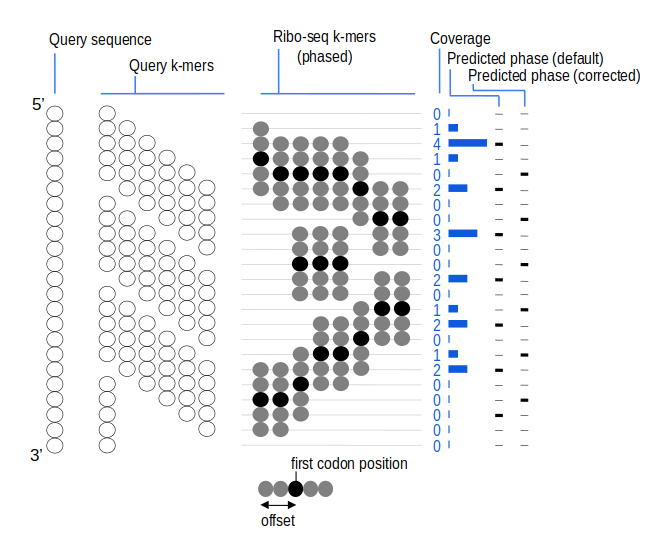
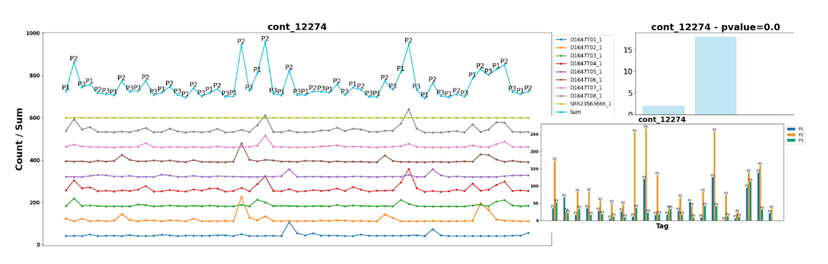

# RiboKast: Reference-Free Translation Prediction from Ribo-Seq Data Using K-mers

## 🧬 Overview

**RiboKast** is a reference-free computational pipeline for identifying translated ORFs from RNA sequences using ribosome profiling (ribo-seq) data. It queries k-mers from input RNA sequences against a ribo-seq k-mer index and analyzes frame-specific coverage to determine translation activity. It is especially useful for novel transcript discovery and non-model organisms, requiring no reference genome or annotation.

---

## ⚙️ Prerequisites

### Software

- **KaMRaT**: used via a Singularity or Docker image.
- **SeqKit**: for FASTA/FASTQ processing.

Install SeqKit with Conda:

```bash
conda install -c bioconda seqkit
```

### Python Libraries

Install with pip:

```bash
pip install pandas matplotlib pillow
```

Required libraries:

- `pandas`
- `matplotlib`
- `argparse`
- `re`
- `sys`
- `Pillow`

---

## 🧪 Protocol Workflow

### A. Contig-Level Analysis

1. **K-mer Generation**: Input RNA sequences are split into overlapping k-mers.
2. **K-mer Querying**: Each k-mer is queried against a ribo-seq index using KaMRaT.
3. **Coverage Summing**: Ribo-seq signal is summed per reading frame (P1, P2, P3).
4. **Frame Prediction**: The frame with the highest signal is considered dominant.
5. **Statistical Validation**: A binomial test is performed (p < 0.05).
6. **Contig Classification**:
   - **RS+P+**: Signal present, dominant frame validated.
   - **RS+P-**: Signal present, but frame not validated.
   - **RS-**: No ribo-seq signal detected.



**Figure – RiboKast strategy.** The central part (Ribo-seq k-mers) represents an index of k-mers extracted from multiple ribo-seq experiments. In this index, all k-mers have the same size and codon position. K-mers from the query sequence are queried against the index to produce a coverage vector. The major phase (predicted phase) is inferred from the coverage vector. A binomial test evaluates the significance of the major phase compared to alternative phases. Optionally, the reading phase can be corrected (adding +1 or +2) based on the offset of codons in ribo-seq k-mers.

### B. ORF-Level Peptide Translation

- **RS+P+**: Translate only in predicted frame.
- **RS+P-**: Translate in 3 frames(stranded).
- **RS-**: Translate in 3 frames(stranded).

### Peptide Selection Rules

- For **RS+P+**: keep the peptide before the first stop.
- For **RS+P- / RS-**:
  - Take the peptide before the stop.
  - After the first stop, keep peptides starting with M until the next stop.

### RS State Assignment

Each peptide's nucleotide region is re-queried in the ribo-seq index:
- A peptide is **RS+** if it overlaps an RS+ region of the contig.
- A single contig can yield multiple peptides with different RS states.

---
## 📁 Input Format

### 🧬 Example Input FASTA

```fasta
>cont_7
AAAAAAAAAAAAAAAAAAAAAGCAGCAGCACCTCATCCATTCAAGTTTGATCACGAGATTGAAGCAATTCAGTGACATCTTTAGGCTACACTTCTAAATCTAGCTCTCTTGCTATTTTCACCACATCTATAGTTGCTTCCTCCACTGAAGTCTCAAACCCCTCAAAGATTCATGAGGGCTGGAATCAGGTTTTTCCAAAATAC
>cont_40
AAAAAAAAAAAAAAAACCATGCATTGCTGCTTTTCCTACCACTTCCAGTAAGAAAATGGG
```

Each sequence in the FASTA file represents a contig with a unique identifier (`>cont_X`). These RNA sequences serve as the input for k-mer generation and ribo-seq signal querying throughout the pipeline.

---

### 📝 Optional: Annotation File

Predicted peptides can optionally be merged with external annotations to enrich biological interpretation. This is done by providing an **annotation file** (TSV format), typically generated using the [Annotate-contigs](https://github.com/Transipedia/Annotate-contigs) tool.
> If provided, the annotation file is automatically integrated during the final merge step, linking peptide-level predictions with known biological features.


## 📤 Output

- **RS+P+**: High ribo-seq signal and validated dominant frame.
- **RS+P-**: Signal present, frame not statistically validated.
- **RS-**: No ribo-seq signal.

## 📤 Output Example

The RiboKast pipeline produces results at both the **contig level** and the **ORF (peptide) level**.

---

### 🧬 Contig-Level Output

**File:** `KmersFromContigsQuerySumPhaseSeqTranslatedPvalueRSState`  
This file summarizes k-mer coverage and translation frame predictions for each contig.

**Columns:**
- `contig`: Nucleotide sequence of the contig
- `ID_contig`: Contig identifier
- `P1`, `P2`, `P3`: Read counts per frame
- `Dominant_Phase`: Most expressed reading frame (p1/p2/p3)
- `Functional_dominant_phase`: Frame used for translation (1/2/3)
- `translated_seq`: Protein sequence obtained from the selected frame
- `p_value`: Significance of the dominant frame (binomial test)
- `RSState`: Ribosome state classification

**Example:**

| contig | ID_contig | P1 | P2 | P3 | Dominant_Phase | Functional_dominant_phase | translated_seq | p_value | RSState |
|--------|-----------|----|----|----|----------------|----------------------------|----------------|---------|---------|
| AAAAAAAAAA... | AAAAAAAAAAAA...CATAACC_unsSeq | 2 | 0 | 0 | p1 | 1 | KKKKKKKKHNQVWQDQT... | 0.1111 | RS+P- |
| AAAAAAAAAA... | AAAAAAAAAAAA...CCCAGTG_unsSeq | 2 | 0 | 0 | p1 | 1 | KKKKKKKPSEVQIYVHQ... | 0.1111 | RS+P- |
| TACTGATCAG... | AAAAAAAAAAAA...CTCCCG_unsRev  | 2 | 0 | 1 | p1 | 1 | Y*SAREFFFFFFFF       | 0.2593 | RS+P- |
| GTTTTCCAGC... | AAAAAAAAAAAA...CATAACC_unsRev | 1 | 1 | 1 | p1 | 1 | VFQQGSQTLMPSAAR...   | 1.0000 | RS+P- |
| AAAAAAAA...   | AAAAAAAAAAAA...CCCAGTG_unsSeq7| NA | NA | NA | NA | NA | NA                 | NA     | RS-   |

---

### 🧬 ORF-Level Output

**File:** `ORFs_RSState.tsv`  
This table contains peptides extracted from contigs and their associated ribo-seq phasing information.

**Columns:**
- `Contig_id`: Identifier of the original contig
- `Peptide`: Translated peptide sequence
- `P1`, `P2`, `P3`: Read counts associated with the peptide region
- `Dominant_Phase`: Most expressed reading frame in that region
- `Functional_dominant_phase`: Predicted frame used for translation
- `p_value`: Binomial test result for the phase
- `RSState`: RS classification of the peptide (RS+P+, RS+P-, RS-)

**Example:**

| Contig_id | Peptide | P1 | P2 | P3 | Dominant_Phase | Functional_dominant_phase | p_value | RSState |
|-----------|---------|----|----|----|----------------|----------------------------|---------|---------|
| AAAAAAAAAAAA...CATAACC_unsSeq | KKKKKKKKHNQVWQDQT | 2 | 0 | 0 | p1 | 1 | 0.1111 | RS+P- |
| AAAAAAAAAAAA...CCCAGTG_unsSeq | KKKKKKKPSEVQIYVHQSGSN | 2 | 0 | 0 | p1 | 1 | 0.1111 | RS+P- |
| AAAAAAAAAAAA...CATAACC_unsRev | FPAGVANSNAFSSQASNSL... | 0 | 1 | 1 | p2 | 2 | 1.0000 | RS+P- |

---

> 🔎 RS+P+: Signal present and frame validated  
> 🔎 RS+P-: Signal present but frame not validated  
> 🔎 RS-: No ribo-seq signal detected

---

## 📈 Visual Output

The pipeline generates plots showing:

- Translation frame periodicity
- Frame dominance per contig

Example:



---
## 📜 Scripts Summary

The RiboKast pipeline is organized into modular scripts, with all configuration centralized in the `config.sh` file.

- `RiboKast_cont_orf.sh`: The main script that coordinates the full pipeline, including both contig-level and ORF-level analysis. It internally calls:
  - `run_RiboKast.sh`: Handles k-mer generation, ribo-seq querying, phasing analysis, and contig translation.
  - `ORFpred.sh`: Performs ORF prediction and extracts peptides based on RS state and translation logic.

- `post_process_RiboKast.sh`: Generates summary plots and visualizations to interpret and explore the results.

To run the pipeline, make sure the main scripts and the `config.sh` file are located in the same directory.  
Then launch the main workflow with:

```bash
bash RiboKast_cont_orf.sh
```
- **Additional scripts**: Located in the `SCRIPTS/` directory. These include:
  - K-mer generation tools
  - Statistical analysis (e.g., binomial testing)
  - Translation scripts
  - Peptide RS-state reassignment

> 🔧 **Note**: All paths, parameters, and environment variables are defined in the `config.sh` file. Make sure to update it before running the pipeline.


---

## 🧠 Notes

- The default **k-mer length** is `20`, which should match the k-mer length used to build the ribo-seq index.
- The default **phase shift** is `0` and is configurable.  
  This value represents the reading frame offset and can be adjusted (e.g., `+1` or `+2`) depending on the codon alignment within the ribo-seq k-mers.

---

## 📂 Repository

All scripts and examples are available at:
```
https://github.com/Transipedia/RiboKast
```
